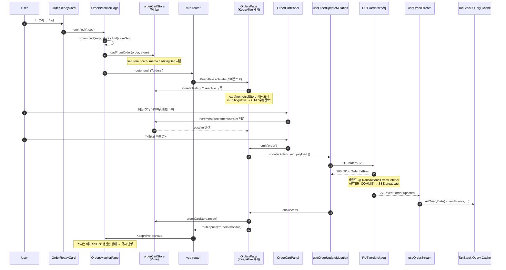
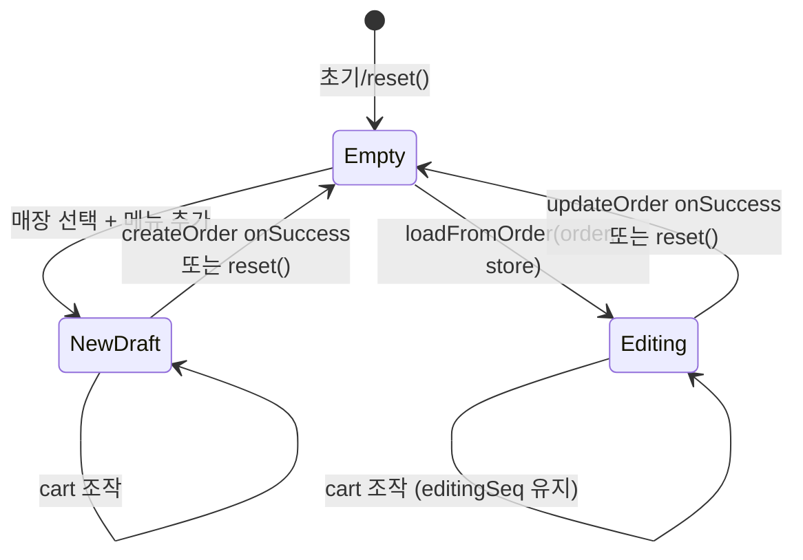

# 주문 수정 플로우

`OrdersMonitorPage` 의 진행중 카드에서 ⋮ → 수정 클릭 → `OrdersPage` 로 이동해서 카트 복원 → 수정 후 저장 → 모니터로 복귀까지의 전체 흐름.

> 관련 문서: [ARCHITECTURE.md](../ARCHITECTURE.md), [WEBSOCKET_PLAN.md](../WEBSOCKET_PLAN.md)

---

## 1. 개요

### Trigger

- 진입점: `/orders/monitor` 의 `OrderReadyCard` (READY 상태 카드만 노출)
- UI: ⋮ (more menu) → "수정" 항목 클릭

### 목표

- 기존 주문 데이터(매장/메뉴/요청사항)를 카트에 복원
- 사용자가 OrdersPage 의 익숙한 인터페이스로 수정
- 저장 시 `PUT /orders/{seq}` — t_order_menu 통째 교체
- 모니터로 자동 복귀, 변경 즉시 반영 (SSE)

---

## 2. 전체 시퀀스 다이어그램



---

## 3. 단계별 상세

### Step 1 — 수정 진입

**사용자 액션**: `OrderReadyCard` 의 ⋮ → 수정

**코드**:

```ts
// OrderReadyCard.vue
const cMenuItems = computed<MenuItem[]>(() => [
  { label: "수정", command: () => emit("edit", props.order.seq) },
  { label: "삭제", command: () => emit("remove", props.order.seq) },
]);
```

→ `edit` 이벤트가 부모 `OrdersMonitorPage` 로 전달.

### Step 2 — Hydrate orderCartStore

```ts
// OrdersMonitorPage.vue
function onEdit(seq: number) {
  const order = orders.value?.find((o) => o.seq === seq);
  if (!order) return;
  const store = stores.value?.find((s) => s.seq === order.storeSeq);
  if (!store) return;
  orderCartStore.loadFromOrder(order, store);
  router.push("/orders");
}
```

- `orders` 캐시(useOrdersMonitorQuery)와 `stores` 캐시(useStoresQuery) 에서 데이터 lookup
- store 의 `loadFromOrder` 가 모든 상태 일괄 hydrate

### Step 3 — Store 의 데이터 변환

```ts
// stores/orderCartStore.ts
function loadFromOrder(order: OrderExt, store: Store) {
  selStore.value = store;
  cart.value = order.menus.map((m) => ({
    menuSeq: m.menuSeq,
    nm: m.menuNm, // OrderMenuExt → CartItem
    price: m.price, // 원본 스냅샷 가격 유지
    cnt: m.cnt,
  }));
  memo.value = order.cmt ?? "";
  editingSeq.value = order.seq; // ← 수정 모드 표시
}
```

**핵심 매핑**: `OrderMenuExt` (서버 형식, `menuNm`) → `CartItem` (UI 형식, `nm`)

**가격 정책**: 원본 주문 시점의 단가를 그대로 유지 (스냅샷). 메뉴 마스터의 현재 단가로 갱신하지 않음.

### Step 4 — 라우팅 + KeepAlive

```ts
router.push("/orders");
```

- `OrdersPage` 는 영업 그룹(`NAV_GROUPS.SALES`) 라 KeepAlive 캐시 대상 ([AppLayout.vue](../../src/layouts/AppLayout.vue))
- 이미 한 번 마운트된 적 있으면 → `onActivated` 만 발화, `onMounted` 안 발화
- **store 가 reactive** 라 캐시된 컴포넌트가 자동으로 새 상태 반영

### Step 5 — OrdersPage 가 store 구독

```ts
// OrdersPage.vue
const orderCartStore = useOrderCartStore();
const { selStore, cart, memo, isEditing, editingSeq } =
  storeToRefs(orderCartStore);
```

- storeToRefs 로 reactive ref 추출
- 템플릿에서 자동 unwrap → `selStore`, `cart`, `memo` 그대로 사용
- `isEditing` 이 OrderCartPanel 의 CTA 분기 트리거

### Step 6 — UI 분기

```vue
<!-- OrderCartPanel.vue -->
<BButton :disabled="cState !== 'has-items'" @click="emit('order')">
  <span>{{ isEditing ? '수정완료' : '주문완료' }}</span>
</BButton>
```

`isEditing === true` 일 때만 라벨이 "수정완료" 로 변경.

### Step 7 — 사용자 수정

기존 cart 조작 액션이 그대로 작동:

- 메뉴 추가: `MenuGrid` → `addItem(menu)` (스토어 액션)
- 수량 ±: `CartItemRow` → `increment` / `decrement`
- 직접 수량 입력: `setCnt`
- 메모 수정: `v-model:memo`

→ store 의 `cart`, `memo` 가 reactive 하게 갱신.

### Step 8 — 저장 (PUT)

```ts
// OrdersPage.vue#onOrder
function onOrder() {
  if (!selStore.value || cart.value.length === 0) return;
  const payload = {
    storeSeq: selStore.value.seq,
    cmt: memo.value || undefined,
    menus: cart.value.map(({ menuSeq, price, cnt }) => ({
      menuSeq,
      price,
      cnt,
    })),
  };

  if (isEditing.value && editingSeq.value != null) {
    updateOrder(
      { seq: editingSeq.value, payload },
      {
        onSuccess: () => {
          orderCartStore.reset();
          toast.add({
            severity: "success",
            summary: "주문 수정 완료",
            life: 2000,
          });
          router.push("/orders/monitor");
        },
        onError: () => {
          /* 에러 토스트 */
        },
      },
    );
    return;
  }

  // 신규 분기 (생략)
}
```

- `editingSeq` 가 mutation 의 PathVariable 로 사용
- payload 는 create 와 동일 구조 (`OrderUpdatePayload = OrderCreatePayload`)

### Step 9 — Backend 처리

```
POST/PATCH 등 → @Transactional → DB save → publishEvent(Updated) → AFTER_COMMIT → broadcast SSE
```

- `OrderEventListener.on(OrderEvent.Updated)` → `OrderEventPublisher.broadcast("order:updated", ext)`
- 모든 연결된 클라이언트가 이벤트 수신

### Step 10 — SSE 캐시 패치

```ts
// useOrderStream.ts
eventSource.addEventListener("order:updated", (e) => {
  const order = JSON.parse(e.data) as OrderExt;
  queryClient.setQueryData<OrderExt[]>(QUERY_KEYS.ordersMonitor, (old) =>
    old?.map((o) => (o.seq === order.seq ? order : o)),
  );
});
```

→ 동일 seq 의 항목을 새 데이터로 교체.

### Step 11 — 사이드 이펙트 + 복귀

`onSuccess` 핸들러:

```ts
orderCartStore.reset(); // editingSeq, cart, memo 모두 초기화
toast.add({ summary: "주문 수정 완료" });
router.push("/orders/monitor"); // 모니터로 복귀
```

`OrdersMonitorPage` 도 KeepAlive 라 즉시 활성화됨. SSE 로 이미 캐시 갱신된 상태라 변경 즉시 반영.

---

## 4. 관여 파일/모듈

| 역할               | 파일                                                                           |
| ------------------ | ------------------------------------------------------------------------------ |
| 진입 카드          | [OrderReadyCard.vue](../../src/components/orders-monitor/OrderReadyCard.vue)   |
| 모니터 페이지      | [OrdersMonitorPage.vue](../../src/pages/OrdersMonitorPage.vue)                 |
| 주문 작성 페이지   | [OrdersPage.vue](../../src/pages/OrdersPage.vue)                               |
| 카트 패널          | [OrderCartPanel.vue](../../src/components/panel/order-cart/OrderCartPanel.vue) |
| Pinia 스토어       | [orderCartStore.ts](../../src/stores/orderCartStore.ts)                        |
| API 호출           | [ordersApi.ts](../../src/apis/ordersApi.ts) — `update(seq, payload)`           |
| Mutation 훅        | [ordersQuery.ts](../../src/queries/ordersQuery.ts) — `useOrderUpdateMutation`  |
| SSE 핸들러         | [useOrderStream.ts](../../src/composables/useOrderStream.ts) — `order:updated` |
| 라우팅 + KeepAlive | [AppLayout.vue](../../src/layouts/AppLayout.vue)                               |

---

## 5. orderCartStore 의 상태 전이



| 상태     | `editingSeq` | `selStore` | `cart`     | `isEditing` |
| -------- | ------------ | ---------- | ---------- | ----------- |
| Empty    | null         | null       | []         | false       |
| NewDraft | null         | Store      | [...items] | false       |
| Editing  | number       | Store      | [...items] | true        |

`editingSeq` 단일 필드가 모드 분기의 **유일한 truth source**.

---

## 6. KeepAlive 와의 상호작용

### 왜 매끄럽게 동작하는가

OrdersPage 가 영업 그룹 KeepAlive 대상이라:

1. 첫 진입 시 마운트, 이후 deactivate / activate 만 반복
2. **Pinia store 는 mount/unmount 와 무관** — 항상 reactive
3. 따라서 monitor → orders 진입 시:
   - store.loadFromOrder() 는 monitor 핸들러에서 실행
   - cached OrdersPage 의 reactive 구독자(`storeToRefs`) 가 즉시 반영
   - 별도 `onActivated` 핸들러 작성 불필요

### 만약 KeepAlive 가 없다면

- OrdersPage 매번 새로 마운트
- `useMenusQuery` 등도 매번 호출 (캐시는 vue-query 가 처리하지만)
- `useOrderCartStore()` 호출 → 같은 store 인스턴스 반환 (Pinia singleton)
- 결과적으로 같은 동작 — KeepAlive 는 성능 최적화일 뿐, 정합성과 무관

---

## 7. SSE 와의 상호작용

### Self-echo (자기 액션의 SSE 수신)

수정 mutation 호출자도 동일한 `order:updated` SSE 이벤트를 받음:

- `setQueryData` 는 idempotent — 동일 데이터 재할당 무해
- 다른 탭/사용자도 같은 시점에 캐시 갱신됨

### 모니터 도착 시점

타이밍은 보통 다음 순서:

1. `onSuccess` 즉시 → reset + toast + push
2. SSE event 수신 (수 ms 이내) → setQueryData
3. 모니터 페이지 활성화 → 이미 갱신된 캐시 표시

→ 사용자 체감 지연 ~0.

### 만약 SSE 끊겨 있으면

- mutation 응답은 정상
- 캐시는 갱신 안 됨 (stale)
- 모니터 도착 → stale 데이터 표시 (오래된 카드 내용)
- EventSource 자동 재연결 → `onopen` → invalidate → fresh fetch → 보정

---

## 8. Edge cases

| 상황                                       | 처리                                                                                                  |
| ------------------------------------------ | ----------------------------------------------------------------------------------------------------- |
| `orders.find(seq)` 못 찾음                 | 함수 early return — 클릭은 무시됨 (캐시 race condition)                                               |
| `stores.find(storeSeq)` 못 찾음            | 동일하게 early return                                                                                 |
| 수정 도중 다른 페이지 이동                 | store 상태 유지 → 다시 /orders 진입 시 이전 편집 상태 표시                                            |
| 영업 외 페이지로 이동                      | KeepAlive evict (캐시 destroy), **하지만 Pinia store 는 살아있음** → 다시 진입 시 hydrate 상태 그대로 |
| 다른 사용자가 동시에 같은 주문 COOKED 처리 | 백엔드가 status 검증 → 409 등 반환 (현재 미구현, 추후)                                                |
| 수정 도중 원본 주문이 외부에서 삭제        | PUT → 404 → onError 토스트                                                                            |
| 카트 비우고 수정완료                       | guard `cart.length === 0` 으로 early return                                                           |
| 수정 취소 (버튼 없음, 그냥 뒤로가기)       | store 가 그대로 유지됨 — 다음 진입 시 이전 편집 상태 표시 (의도된 동작)                               |

---

## 9. UI 분기 요약

| 위치                      | 분기 조건                         | 결과                                         |
| ------------------------- | --------------------------------- | -------------------------------------------- |
| `OrderCartPanel` CTA 라벨 | `isEditing`                       | "주문완료" / "수정완료"                      |
| `OrdersPage#onOrder` 분기 | `isEditing && editingSeq != null` | createOrder / updateOrder                    |
| Toast 메시지              | mutation 분기                     | "주문 접수" / "주문 수정 완료"               |
| router.push               | mutation 분기                     | (create) 머무름 / (update) `/orders/monitor` |

---

## 10. 테스트 시나리오

### 정상 플로우

1. `/orders/monitor` 에서 진행 중 카드 1개 → ⋮ → 수정
2. `/orders` 로 이동
3. 카트에 원본 메뉴 들어있는지 확인
4. 매장명 / 메모 표시 확인
5. CTA 라벨 "수정완료" 확인
6. 메뉴 수량 변경 + 메모 수정
7. 수정완료 클릭 → 토스트 "주문 수정 완료"
8. `/orders/monitor` 자동 복귀
9. 카드의 메뉴 / 금액 / 메모 변경 반영 확인

### 멀티 탭 SSE 검증

1. 탭1: `/orders/monitor` 열기
2. 탭2: `/orders/monitor` 에서 수정 → `/orders` → 수정완료
3. 탭1 의 카드 즉시 갱신 ✅

### 수정 취소 (편집 보존)

1. ⋮ → 수정 → `/orders`
2. 카트 변경하다가 사이드바에서 다른 페이지 (영업 그룹 내) 이동
3. 다시 `/orders` 진입 → **이전 편집 상태 그대로 보존** ✅

### KeepAlive evict

1. ⋮ → 수정 → `/orders`
2. 사이드바에서 영업 외 페이지 (정산 등) 이동
3. 다시 `/orders` 진입 → 페이지는 새로 마운트되지만 **store 가 살아있어 카트 hydrate 상태 보존** ✅

---

## 11. 디자인 결정 기록

### 왜 PUT 전체 교체인가

- `t_order_menu` 가 별도 테이블 → 부분 수정(PATCH) 시 add/remove/update 분기 복잡
- 클라이언트 카트 구조와 동일한 payload 로 단순화
- 백엔드는 기존 t_order_menu 일괄 삭제 + 새로 insert (트랜잭션 내)
- 단점: 변경 안 된 항목도 다시 보냄 — payload 약간 큼 (실용 무시)

### 왜 가격은 스냅샷 유지

- 주문 시점의 가격이 매출 정합성의 기준
- 메뉴 마스터에서 단가 변경되어도 기존 주문 영향 X
- 수정 시에도 원본 가격 유지 — UI 상 "이 주문의 가격" 의미가 일관됨

### 왜 confirm 없이 즉시 호출 (삭제)

- 사용자 결정으로 confirm 생략
- 실수 시 재생성 가능 (취소 가능한 일회성 작업)

### 왜 수정 모드 진입 시 confirm 없이 store 덮어쓰기

- 작성 중인 다른 신규 주문이 있다면 손실 가능
- 현재는 단순화 위해 immediate 적용
- 향후 "작성 중인 카트가 있습니다, 폐기하고 수정 모드로?" confirm 추가 검토 가능
